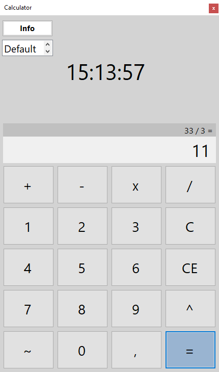
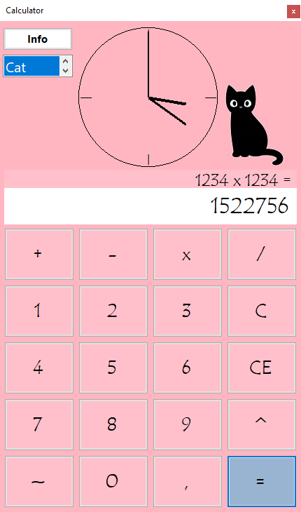

# Simple Calculator

## Overview

The application simulates simple calculator with a clock and different look styles.

## Environment

The program is written in C# .NET Framework 6.0 in the Visual Studio 2022 environment.

## Project Description

The application made is a calculator with a clock function. The application allows you to perform 
basic mathematical operations such as addition, subtraction, multiplication, 
division, multiplication, multiplication of opposite numbers. The numbers stored in the operations can be 
floating point, negative. If you make a mistake, you can delete the entered character 
or clear the calculator screen completely. The application shows the current time on a clock 
digital or analog clock. The user of the application can operate the calculator using the 
mouse or keyboard. There is a button in the application that causes the display of 
additional information-hints on how to use it. Throughout the program's operation 
a list is also available, with which you can change the appearance of the application. The high 
configurability of the calculator is affected by the ability to choose a digital or analog clock
for displaying the current time, and the ability to change the calculator skin to one of the 
of three prepared sets or "custom" by choosing the calculator's color scheme and the 
font family used in the application.

## Interface Description

The "Info"-button triggers the display of a window in which tips on how to use the application are stored.
There is a list, from which you can invoke a change in the appearance of the calculator to one of the 
of the following options:
1. Deafult- appearance loaded when the application is launched. 
2. Digital- change font; colors of buttons, labels, background; appearance of PictureBox with a 
picture of a duckling that displays a message when pressed.
3. Cat- change of font; colors of buttons, labels, background; appearance of PictureBox with a picture of a 
picture of a cat, which when pressed displays a message. 
4. Custom - selecting this option initiates the display of the ColorDialog window, the color selected in it 
color changes the color of the buttons and the background. Then the FontDialog is displayed, from which the 
information is retrieved what font family the user has selected, it is 
used in the program.
One click on the clock toggles it between analog and digital style.

|  |  |
|:-----------------------:|:-----------------------:|
| Default skin         | Cat theme skin          |
